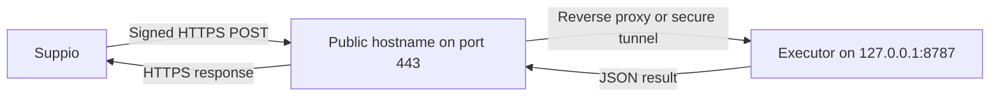

Suppio calls your customer action executor through a public HTTPS URL. Your executor can run on a VPS, inside a private network connected through a tunnel, or on a managed application platform.

This guide covers the complete network path. Read [Customer actions](/customer-actions) for action definitions, request signatures, payloads, results, confirmations, and idempotency.

## How the connection works



`127.0.0.1:8787` is not a public address. It is the loopback address of the machine running your executor. On a VPS, only processes on that VPS can connect to it.

Suppio never connects to `127.0.0.1`. It connects to a public URL such as:

```text
https://actions.example.com/suppio/actions
```

A reverse proxy or tunnel receives that request and forwards it to the executor on the same machine.

## What Suppio expects

Your configured executor URL must meet every requirement below.

| Requirement | Expected behavior |
| --- | --- |
| URL | A stable `https://` URL using a domain name, such as `https://actions.example.com/suppio/actions`. |
| DNS | Every resolved address must be public. Localhost, private network addresses, reserved addresses, and literal IP URLs are blocked. |
| TLS | A valid, publicly trusted certificate for the configured hostname. Do not use a self-signed certificate. |
| Method | Accept `POST` at the exact configured path. |
| Request body | Accept `application/json` and preserve the exact raw bytes until after signature verification. |
| Authentication | Verify `X-Suppio-Timestamp`, `X-Suppio-Signature`, and `X-Suppio-Action-Id`. |
| Redirects | Return a response directly. Suppio does not follow `301`, `302`, `307`, or `308` redirects. |
| Response time | Respond within 15 seconds. |
| Response size | Return no more than 64 KB. Keep `summary` at or below 2,000 characters. |
| Response format | Return a JSON success or failure result described in [Return a result](/customer-actions#return-a-result). |

Suppio resolves the hostname before connecting and pins the request to the resolved public address. A hostname that resolves to any private or reserved address is rejected.

<Warning>
  Do not put a browser login, basic authentication prompt, CAPTCHA, or interactive access page in front of the action path. Suppio authenticates with its signature headers and cannot complete an interactive challenge.
</Warning>

## Choose how to publish the executor

<CardGroup cols={3}>
  <Card title="VPS with Caddy" icon="server">
    Point a domain at the VPS. Caddy provides TLS and proxies requests to the loopback service. The VPS public IP appears in DNS.
  </Card>
  <Card title="Cloudflare Tunnel" icon="cloud">
    Create an outbound tunnel from the server. You do not need to open an inbound executor port, and the origin IP does not need to appear in public DNS.
  </Card>
  <Card title="Managed hosting" icon="boxes-stacked">
    Deploy the executor to a container or application platform that supplies a stable public HTTPS URL.
  </Card>
</CardGroup>

## Option 1: VPS with Caddy

This is the simplest direct VPS setup. The examples assume a Debian or Ubuntu server, a domain you control, and an executor application installed in `/opt/customer-actions`.

### Before you start

You need:

- a VPS with a public IPv4 address or properly configured public IPv6 address
- SSH access with `sudo`
- a domain or subdomain you control
- your executor application from [Verify signatures](/customer-actions#verify-signatures)
- the signing secret shown by the Suppio dashboard

Do not use `CUSTOMER_ACTION_ENCRYPTION_KEY` in the executor. Your executor only needs the per-agent signing secret shown when you save or rotate the endpoint.

<Steps>
  <Step title="Bind the executor to loopback">
    Run the application on `127.0.0.1`, not `0.0.0.0`. A Node and Express application can finish its setup like this:

    ```ts
    const host = process.env.HOST ?? "127.0.0.1";
    const port = Number(process.env.PORT ?? "8787");

    app.get("/health", (_req, res) => {
      res.json({ ok: true });
    });

    const server = app.listen(port, host, () => {
      console.log(`Customer action executor listening on ${host}:${port}`);
    });

    server.on("error", (error) => {
      console.error("Customer action executor failed to start", error);
      process.exitCode = 1;
    });
    ```

    Test it from the VPS:

    ```bash
    curl --fail --show-error http://127.0.0.1:8787/health
    ```

    This command should return `{"ok":true}`. It should fail when run from another machine because port `8787` is not public.
  </Step>

  <Step title="Store the signing secret outside the application">
    Create a dedicated service account and a root-readable environment file:

    ```bash
    sudo useradd --system --home /opt/customer-actions --shell /usr/sbin/nologin customer-actions
    sudo install -d -o customer-actions -g customer-actions /opt/customer-actions
    sudo install -m 600 -o root -g root /dev/null /etc/customer-actions.env
    sudoedit /etc/customer-actions.env
    ```

    Add these values in the editor. Replace the placeholder only on your server:

    ```dotenv
    SUPPIO_ACTION_SECRET=PASTE_THE_SIGNING_SECRET_FROM_THE_DASHBOARD
    HOST=127.0.0.1
    PORT=8787
    NODE_ENV=production
    ```

    Never commit this file, paste its contents into support messages, or include it in application logs. If your application needs other credentials, store them in the same protected secret system or your provider's secret manager.
  </Step>

  <Step title="Run the executor as a service">
    Build your application and place its production files in `/opt/customer-actions`. Create `/etc/systemd/system/customer-actions.service`:

    ```ini
    [Unit]
    Description=Customer action executor
    After=network-online.target
    Wants=network-online.target

    [Service]
    Type=simple
    User=customer-actions
    Group=customer-actions
    WorkingDirectory=/opt/customer-actions
    EnvironmentFile=/etc/customer-actions.env
    ExecStart=/usr/bin/node /opt/customer-actions/dist/server.js
    Restart=on-failure
    RestartSec=5
    UMask=0077
    NoNewPrivileges=true
    PrivateTmp=true
    ProtectHome=true
    ProtectSystem=strict

    [Install]
    WantedBy=multi-user.target
    ```

    Update `ExecStart` if your runtime or built entry file uses a different path. Then enable the service:

    ```bash
    sudo systemctl daemon-reload
    sudo systemctl enable --now customer-actions
    sudo systemctl status customer-actions
    ```

    View recent service logs without printing environment variables or request payloads:

    ```bash
    sudo journalctl -u customer-actions --since "10 minutes ago"
    ```
  </Step>

  <Step title="Point a hostname at the VPS">
    Create an `A` record with your DNS provider:

    ```text
    Type: A
    Name: actions
    Value: YOUR_VPS_PUBLIC_IPV4_ADDRESS
    ```

    This produces `actions.example.com`. Add an `AAAA` record only when the VPS has working public IPv6 and its firewall is configured for IPv6.

    Check DNS from a machine outside the VPS:

    ```bash
    dig +short actions.example.com
    ```

    A direct DNS record reveals the VPS public IP. Use [Cloudflare Tunnel](#option-2-cloudflare-tunnel) instead if you do not want the origin IP in public DNS.
  </Step>

  <Step title="Install and configure Caddy">
    Install Caddy using its [official installation instructions](https://caddyserver.com/docs/install). The official Debian and Ubuntu package runs Caddy as a system service.

    Replace `/etc/caddy/Caddyfile` with:

    ```caddyfile
    actions.example.com {
      @executor path /suppio/actions /health

      handle @executor {
        reverse_proxy 127.0.0.1:8787
      }

      respond 404
    }
    ```

    Validate and reload the configuration:

    ```bash
    sudo caddy validate --config /etc/caddy/Caddyfile
    sudo systemctl reload caddy
    sudo systemctl status caddy
    ```

    Caddy obtains and renews a publicly trusted TLS certificate when the hostname points to the VPS and ports `80` and `443` reach Caddy. See the [Caddy HTTPS reverse proxy guide](https://caddyserver.com/docs/quick-starts/reverse-proxy) for the underlying behavior.
  </Step>

  <Step title="Configure the firewall">
    Keep SSH available, allow HTTP and HTTPS for Caddy, and do not open port `8787`:

    ```bash
    sudo ufw allow OpenSSH
    sudo ufw allow 80/tcp
    sudo ufw allow 443/tcp
    sudo ufw enable
    sudo ufw status
    ```

    Confirm the SSH rule before enabling the firewall so you do not lock yourself out. If your VPS provider has a separate network firewall, apply the same inbound rules there. Ubuntu documents the available commands in its [firewall guide](https://ubuntu.com/server/docs/security-firewall/).
  </Step>

  <Step title="Verify public HTTPS">
    Test the public health endpoint:

    ```bash
    curl --fail --show-error https://actions.example.com/health
    ```

    Confirm that an unrelated path returns `404`:

    ```bash
    curl --silent --output /dev/null --write-out "%{http_code}\n" https://actions.example.com/not-an-action
    ```

    Do not test the action path with a hand-written unsigned request and expect success. Use **Test connection** so Suppio sends the correctly signed `customer_action.test` event.
  </Step>

  <Step title="Connect the endpoint in Suppio">
    In **Customer actions**, enter:

    ```text
    https://actions.example.com/suppio/actions
    ```

    Select **Save endpoint**, copy the signing secret into `/etc/customer-actions.env`, restart the executor, and then select **Test connection**:

    ```bash
    sudo systemctl restart customer-actions
    sudo systemctl status customer-actions
    ```

    Turn on the endpoint after the connection test succeeds. The endpoint switch saves immediately.
  </Step>
</Steps>

## Option 2: Cloudflare Tunnel

Cloudflare Tunnel is useful when you do not want to publish the VPS origin IP or open inbound ports `80` and `443`. The `cloudflared` service makes an outbound connection from your server to Cloudflare and forwards the public hostname to `127.0.0.1:8787`.

You need a domain managed in Cloudflare and the executor already running on loopback.

<Steps>
  <Step title="Create a production tunnel">
    In Cloudflare, open **Networking** and then **Tunnels**. Create a remotely managed tunnel and choose the operating system used by your server.

    Follow Cloudflare's [Create a tunnel](https://developers.cloudflare.com/cloudflare-one/networks/connectors/cloudflare-tunnel/get-started/create-remote-tunnel/) guide. Run the installation command Cloudflare generates on the VPS.

    The installation command contains a tunnel credential. Treat it like a secret. Do not commit it, place it in documentation, or paste it into logs or support messages.
  </Step>

  <Step title="Publish the executor hostname">
    Add a published application route with:

    ```text
    Hostname: actions.example.com
    Service URL: http://127.0.0.1:8787
    ```

    Cloudflare forwards the original path, so Suppio can use `https://actions.example.com/suppio/actions`.
  </Step>

  <Step title="Keep the action path machine-accessible">
    Do not require a Cloudflare Access login, browser challenge, or CAPTCHA on `/suppio/actions`. If you use WAF or bot rules, create a narrow exception that allows `POST` requests to the action path to reach your executor. The executor must still verify every Suppio signature.
  </Step>

  <Step title="Check tunnel connectivity">
    Confirm that the tunnel is healthy in Cloudflare and that the public health endpoint works:

    ```bash
    curl --fail --show-error https://actions.example.com/health
    ```

    `cloudflared` uses outbound connections. If your egress firewall is restrictive, review Cloudflare's [connectivity pre-checks](https://developers.cloudflare.com/cloudflare-one/networks/connectors/cloudflare-tunnel/troubleshoot-tunnels/connectivity-prechecks/).
  </Step>

  <Step title="Test and enable the endpoint">
    Save `https://actions.example.com/suppio/actions` in Suppio, install the displayed signing secret in your executor, select **Test connection**, and then turn on the endpoint.
  </Step>
</Steps>

<Warning>
  A random `trycloudflare.com` Quick Tunnel is appropriate for temporary development only. Its hostname can change, and Cloudflare does not provide a production uptime guarantee for Quick Tunnels. Use a remotely managed tunnel with your own stable hostname for real actions.
</Warning>

## Option 3: Managed application hosting

A managed container, application, or serverless platform can work when it provides a stable public HTTPS hostname. Configure the platform so that:

- the action route accepts direct HTTPS `POST` requests without a browser login
- the signing secret is stored in the platform's secret manager, not in source code
- your framework exposes the original raw request body before JSON parsing
- the platform does not redirect the configured action path
- cold starts and action execution finish within 15 seconds
- the response body stays below 64 KB
- the application has a persistent database or durable store for `action_id` deduplication
- logs exclude signature headers, secrets, raw request bodies, arguments, and result data

Some serverless frameworks parse and reconstruct JSON before your handler runs. Signature verification fails if you calculate the HMAC over reconstructed JSON. Enable the platform's raw-body mode and verify the signature before calling `JSON.parse`.

Use the exact HTTPS URL shown by the platform, including the final action path. Custom domains are optional, but the URL must remain stable.

## The complete request lifecycle

For every real action, your executor should follow this order:

1. Receive the HTTPS request at the exact configured path.
2. Limit how much request data the server accepts.
3. Read the timestamp, signature, and action ID headers.
4. Reject a timestamp more than five minutes away from the executor's clock.
5. Calculate the HMAC over the exact raw body and compare it in constant time.
6. Parse JSON only after the signature succeeds.
7. Confirm that the header action ID matches `action_id` in the body.
8. Return success without mutating data when `event` is `customer_action.test`.
9. Atomically claim `action_id` in durable storage. Return the original result if that ID was already processed.
10. Reject action names that are not in an explicit handler allowlist.
11. Validate every argument again in your application.
12. Authorize `actor.user_id` for the targeted account or resource.
13. Perform the action once.
14. Return a `succeeded` or `failed` JSON result within 15 seconds.

The signature proves that Suppio sent an unchanged request. It does not prove that the Discord user is authorized to modify a record in your application. Your executor remains responsible for that authorization decision.

## Security checklist

- Bind the executor to `127.0.0.1` when a reverse proxy or tunnel runs on the same machine.
- Run the executor as a dedicated non-root user.
- Keep the signing secret in a protected environment file or secret manager.
- Verify signatures against raw bytes before parsing JSON.
- Keep the server clock synchronized so timestamp checks are reliable.
- Persist `action_id` values before applying side effects.
- Use explicit action handlers instead of dynamic code, commands, URLs, SQL, or unrestricted operation names.
- Validate and authorize arguments even though the action has a strict schema.
- Do not log secrets, signature headers, request bodies, action arguments, or executor result data.
- Rotate the signing secret immediately if it may have been exposed.
- Keep the operating system, runtime, reverse proxy, tunnel client, and dependencies updated.

## Troubleshooting

<AccordionGroup>
  <Accordion title="Suppio rejects the endpoint URL">
    Use a public domain name with `https://`. Suppio rejects IP-address URLs, localhost, loopback addresses, private network addresses, and hostnames whose DNS includes a private or reserved address.
  </Accordion>
  <Accordion title="DNS does not resolve">
    Check the `A` or `AAAA` record with `dig +short actions.example.com`. Wait for the DNS record's time to live after a change. Remove an incorrect `AAAA` record if the server does not have working public IPv6.
  </Accordion>
  <Accordion title="HTTPS certificate creation fails">
    Confirm that the hostname points to the VPS, ports `80` and `443` reach Caddy, no other service occupies those ports, and the domain's certificate authority authorization records permit a public certificate.
  </Accordion>
  <Accordion title="The public URL returns 502">
    The proxy or tunnel cannot reach the executor. Run `curl http://127.0.0.1:8787/health` on the server, inspect the executor service, and confirm the configured local port matches.
  </Accordion>
  <Accordion title="The endpoint returns a redirect">
    Enter the final HTTPS URL and path in Suppio. Remove application redirects such as adding or removing a trailing slash. Suppio does not follow redirects for action requests.
  </Accordion>
  <Accordion title="Signature verification fails">
    Use the exact signing secret shown for that agent. Verify the untouched raw body, not parsed or reformatted JSON. Confirm that the proxy preserves the request body and that the timestamp is treated as a string when constructing the signed value.
  </Accordion>
  <Accordion title="Cloudflare returns a challenge or 403">
    Remove interactive Access, CAPTCHA, and browser challenges from the action path. Adjust WAF rules narrowly for that path while keeping signature verification mandatory in the executor.
  </Accordion>
  <Accordion title="The test works but actions are not available">
    Turn on the executor endpoint, enable the individual action definitions, and start a new Discord ticket or forum workflow run. Existing run traces do not change retroactively.
  </Accordion>
  <Accordion title="Suppio reports an unknown result">
    The request was dispatched, but Suppio lost the connection or reached the 15-second timeout. The mutation may have completed. Look up the request by `action_id`; do not repeat it automatically.
  </Accordion>
</AccordionGroup>

## Go-live checklist

Before enabling production actions, confirm that:

- the public URL uses a valid HTTPS certificate
- the URL returns no redirect
- the executor listens only on loopback or through the intended private network
- the action path has no interactive access challenge
- the signing secret is stored outside source control
- signature, timestamp, action ID, schema, and authorization checks run in the correct order
- every action name maps to one explicit handler
- durable idempotency is working
- known failures return structured failure results
- the executor responds in less than 15 seconds
- **Test connection** succeeds
- the endpoint and intended actions are enabled

